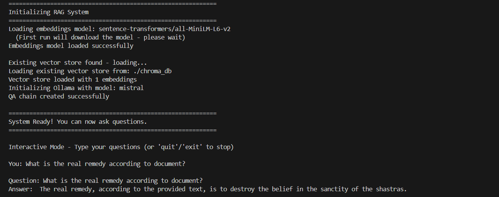

**RAG-Based Q&A System**
======================================

📌 **Project Overview**
-----------------------

This project implements a **Retrieval-Augmented Generation (RAG) system** for answering questions about **Dr. B.R. Ambedkar's speech on the "Annihilation of Caste"**. The system uses **LangChain, ChromaDB, and Ollama** to provide accurate, context-aware answers based solely on the provided text.

All components run **100% locally** with **no API keys or cloud dependencies** required.

🎯 **Key Features**
-------------------

✔️ **Document Loading & Text Chunking:** Intelligent splitting of text into semantic chunks.

✔️ **Semantic Search:** Uses HuggingFace embeddings for accurate retrieval.

✔️ **Context-Aware Q&A:** Powered by Ollama Mistral 7B LLM.

✔️ **Persistent Vector Storage:** ChromaDB stores embeddings locally (no re-embedding needed).

✔️ **Interactive CLI:** Ask questions in real-time or single-question mode.

✔️ **Hallucination Prevention:** Refuses to answer out-of-domain questions.

🏗 **Project Structure**
------------------------

```   Task/  
│  
├── 📂 src/  
│   ├── 📜 __init__.py  
│   ├── 📜 document_loader.py       # Load text documents  
│   ├── 📜 text_processor.py        # Text chunking logic  
│   ├── 📜 embeddings_handler.py    # HuggingFace embeddings  
│   ├── 📜 vector_store.py          # ChromaDB operations  
│   └── 📜 qa_system.py             # RAG chain & LLM integration  
│   
├── 📂 data/  
│   └── 📜 speech.txt               # Dr. Ambedkar's speech  
│  
├── 📂 chroma_db/                   # Vector database (auto-created)  
├── 📜 main.py                      # CLI entry point  
├── 📜 pyproject.toml               # Dependencies  
├── 📜 README.md                    # Project documentation  
└── 📜 .gitignore   
```

⚙️ **Technical Stack**
----------------------
**Orchestration:** LangChain 

**Vector Database:** ChromaDB (persistent, local)

**Embeddings:** sentence-transformers/all-MiniLM-L6-v2 (384 dims)

**LLM:** Ollama Mistral 7B (temperature=0.2)

**Chunk Size:** 500 characters (50 overlap)

**Retrieval:** Top-3 similarity search (cosine)

🛠️ **Prerequisites**
---------------------

Before running this project, ensure you have:

1️⃣ **Python 3.10+** installed

2️⃣ **uv package manager** ([Installation Guide](https://github.com/astral-sh/uv))

3️⃣ **Ollama with Mistral model** ([Download Ollama](https://ollama.com/download))

**Install Ollama and Mistral:**

```   # Download and install Ollama from https://ollama.com/download  # Then pull the Mistral model:  ollama pull mistral   ```

📦 **Installation**
-------------------

1️⃣ **Clone the Repository:**

```   git clone https://github.com/HimanshuBhosale25/RAG-Task.git  cd Task   ```

2️⃣ **Initialize uv for project:**

```   uv init   ```

3️⃣ **Install Dependencies:**

```   uv sync   ```

**Note:** First run will download the sentence-transformers model (~120MB), which takes 2-5 minutes.

🚀 **How to Use**
-----------------

**Interactive Mode (Recommended):**

```   uv run main.py   ```


**Single Question Mode:**

```   uv run main.py -q "What is the real enemy?"   ```

**Force Rebuild Vector Store:**

```   uv run main.py --rebuild   ```

**Custom Speech File:**

```   uv run main.py --speech-file "path/to/custom/speech.txt"   ```

📊 **Sample Output**



🧪 **Example Questions**
------------------------

**Direct Questions:**

✅ "What is the real remedy according to the text?"

✅ "What cannot exist together?"

✅ "What metaphor describes social reform?"

**Paraphrased Questions:**

✅ "Why won't people get rid of caste?"

✅ "Is caste a social reform problem?"

**Out-of-Domain (Should refuse):**

❌ "What was Dr. Ambedkar's birthdate?"

❌ "Tell me about Python programming."

📌 **Methodology & Design Choices**
-----------------------------------

1️⃣ **Document Loading** -- Used LangChain's TextLoader to read speech.txt.

2️⃣ **Text Chunking** -- Split into 500-character chunks with 50-char overlap for context preservation.

3️⃣ **Embeddings** -- HuggingFace all-MiniLM-L6-v2 model with **normalized vectors** for accurate similarity.

4️⃣ **Vector Storage** -- ChromaDB persistent storage prevents re-embedding on every run.

5️⃣ **Retrieval** -- Top-3 similar chunks retrieved using cosine similarity.

6️⃣ **Generation** -- Ollama Mistral 7B with **low temperature (0.2)** to reduce hallucinations.

7️⃣ **Prompt Engineering** -- Explicit instructions to answer only from context, refuse out-of-domain questions.

**Why These Choices?**

**Chunk size 500 chars:** Optimal for short document (~600 chars total)

**Temperature 0.2:** Minimizes hallucinations for factual Q&A

**k=3 retrieval:** Comprehensive context for small corpus

**Normalized embeddings:** Improves cosine similarity accuracy


📝 **Dependencies**
-------------------

Core packages (see pyproject.toml for full list):

`
langchain>=1.0.7
langchain-community>=0.4.1
langchain-ollama>=1.0.0
langchain-huggingface>=0.1.0
langchain-chroma>=0.2.0
langchain-classic>=1.0.0
chromadb>=1.3.4
sentence-transformers>=5.1.2
`

📂 **Deliverables**
-------------------

✅ **Python Source Code** -- Modular, well-commented implementation in src/

✅ **Main Entry Point** -- main.py with CLI interface

✅ **Dependencies File** -- pyproject.toml with uv package manager

✅ **Documentation** -- This README with setup and usage instructions

✅ **Source Text** -- data/speech.txt with Dr. Ambedkar's speech

🏆 **Conclusion**
-----------------

This project successfully demonstrates a **clean and functional RAG pipeline** using modern LangChain architecture. The system balances **accuracy, efficiency, and risk mitigation** (hallucination prevention) while running **100% locally** with no external API dependencies.
